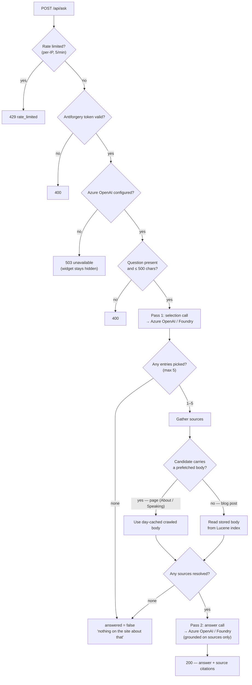
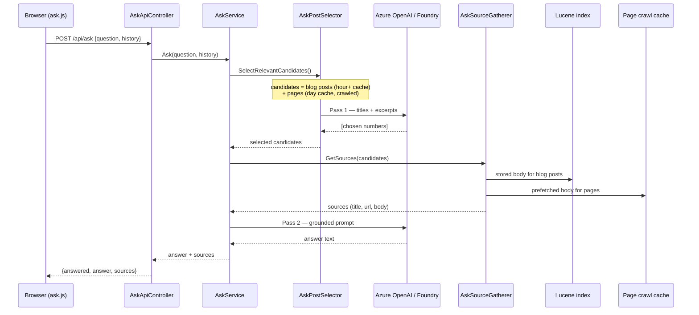

# "Ask" — grounded AI Q&A over the site

A site-wide assistant that answers natural-language questions using **only this site's own
content** (blog posts plus pages like About and Public Speaking) and links back to the sources it
drew from. Opened from the header (`data-ask-open`); the whole surface is progressive enhancement —
with JS disabled nothing renders.

## What it is (and isn't)

It's **retrieval-augmented generation (RAG)**: retrieve relevant content → augment the prompt with
it → generate a grounded answer. What it deliberately is *not* is a vector/embedding pipeline. The
corpus is small enough (~50 posts + a handful of pages) that the model can be shown every title +
excerpt and pick what's relevant itself — "LLM-as-retriever". No embeddings, no vector store, no
chunking, no re-indexing. If the corpus ever outgrows the prompt window, that's the point to
graduate to a real retrieval index (see [Extension ladder](#extension-ladder)).

## How it works — two passes

Every question makes **two** model calls against the Azure AI Foundry deployment:

1. **Selection** (`AskPostSelector`) — the model sees a numbered list of every candidate
   (title + ≤300-char excerpt) and returns the numbers most relevant to the question. This is the
   "retrieval" step.
2. **Answer** (`AskService`) — only the *selected* items' full bodies are injected into a second
   prompt, and the model answers from that content only, with a strict "don't invent, don't use
   outside knowledge" instruction.

The bodies for pass 2 come from **two different places** depending on the content type — that branch
is the heart of the design:

- **Blog posts** — body is read back from the **Lucene index**, where it was captured (crawled +
  sanitised) at search-index time. No re-crawl per question.
- **Pages** (About, Public Speaking, …) — these aren't in the Lucene index, so their body is
  **crawled + sanitised once and cached for a day**, then carried on the candidate object itself.

## Request decision tree

## Sequence

## Components

| Type | Responsibility |
|---|---|
| `AskApiController` (Web) | `POST /api/ask` endpoint. Validates antiforgery, question length, bounds history (12 items × 2000 chars), returns 503 when unconfigured. |
| `AskService` (Core) | Orchestrates the two passes; caps history to the recent turns; builds the grounded answer prompt; owns the system prompt + "no answer" message. |
| `AskContentService` (Core) | Assembles the candidate list: all blog posts (newest first) + page candidates. |
| `AskPageSourceProvider` (Core) | Retrieves `InnerPage` + `PublicSpeakingPage`, crawls + sanitises each body, caches the set for a day. |
| `AskPostSelector` (Core) | Pass 1 — sends the candidate menu to the model and maps the chosen numbers back to candidates. |
| `AskSourceGatherer` (Core) | Resolves selected candidates to full sources — prefetched body (pages) or Lucene lookup (posts). |
| `AzureOpenAIChatClient` (Core) | `IAskChatClient` over the Azure AI Foundry deployment via the OpenAI SDK's version-less v1 API. |
| `AskRateLimitMiddleware` (Web) | Per-IP fixed-window limiter (5/min) on `/api/ask`. |
| `ask.js` / `Ask.cshtml` (Web) | The modal: client-side transcript, quick typewriter reveal, source citations. |

## Data sources & freshness

| Content | Body source | Refreshes when |
|---|---|---|
| Blog posts | Lucene stored field (crawled + sanitised at index time) | Search index is rebuilt |
| Pages (About, Speaking) | Crawled + sanitised on demand, cached | Day cache expires, or any channel publish/edit (cache dependency) |
| Candidate list (posts) | `BlogPostService.GetAllBlogPosts` | Day cache expires, or any channel publish/edit |

The candidate list only ever carries titles + short excerpts; **full bodies are only fetched for the
handful of items the model actually selects**, so the selection call stays small regardless of
corpus size.

## Prompt caching

The selection prompt puts the **large, stable content list first** and the variable
question/history **last**, so Azure OpenAI's automatic prompt caching can reuse the list as a cached
prefix across requests. Reordering these would defeat the cache — see the comment in
`AskPostSelector.BuildUserPrompt`.

## Guardrails

- **Grounding** — answers only from provided content; deflects when nothing is relevant.
- **Per-IP rate limiting** — 5 requests/min (`AskRateLimitMiddleware`), reading the real visitor IP
  via forwarded headers.
- **Antiforgery** — `POST /api/ask` requires a valid token (sent by `ask.js` in the `X-CSRF-TOKEN`
  header), so third-party pages can't drive the paid endpoint.
- **Input bounds** — question ≤ 500 chars; history capped to 12 items × 2000 chars.
- **Spend** — bounded outside the app by the Azure deployment quota + Cost Management budget; the
  feature hides entirely when unconfigured.

## Configuration

Bound from the `AzureOpenAI` config section (`AzureOpenAIOptions`):

| Setting | Notes |
|---|---|
| `AzureOpenAI:Endpoint` | Azure AI Foundry project endpoint (OpenAI-compatible). |
| `AzureOpenAI:ApiKey` | User Secrets locally; env var in production. Never committed. |
| `AzureOpenAI:ChatDeploymentName` | The deployed chat model (e.g. a `gpt-5-nano` deployment). |

When any value is missing, `IAskChatClient.IsConfigured` is `false`: the endpoint returns 503 and the
widget isn't rendered.

## Extension ladder

The current design is rung 1. Later rungs only become worth it as the corpus or the interaction
grows:

1. **Today** — LLM-selection RAG over the full candidate list. Right-sized for ~50 docs.
2. **Function-calling tool** — expose the existing Lucene `/api/search` as a tool the model can
   call, enabling agentic / multi-hop retrieval. Adds round-trips; worth it only for genuine
   multi-step questions.
3. **Azure AI Search "On Your Data"** — index content into Azure AI Search and let Foundry do
   retrieval + citations server-side. New infrastructure; worth it at hundreds/thousands of docs.

Streaming responses (token-by-token) is an orthogonal enhancement to any rung — it would replace the
client-side typewriter with real streamed output and remove the "thinking…" wait.
